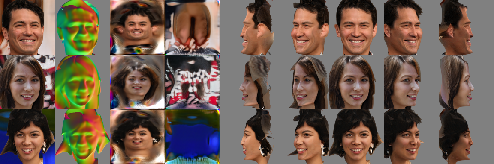

# Pure TensorFlow Renderer

This repository contains a differentiable renderer written purely in TensorFlow. It renders triangle meshes and supports UV mapping. The gradients are calculated exactly with respect to the 3D vertex coordinates and attributes as well. It is achieved by addig small margins at the object boundareis and occlusions which are gradually matted against the background.

## Requirements

* Tensorflow. You can find the installation instructions here: https://www.tensorflow.org/install

We recommend using TensorFlow 2.2, but pTFrenderer is also compatible with TensorFlow 1.5 (with a few warnings).
All platform are supported where Tensorflow can be installed. We tested the renderer on Linux and MacOS with python 3.7. We also tested it on CPU, GPU and TPU in Google Colab. Note that our code is optimized for GPU which provides significantly better performance compared to CPU and TPU.

## Examples

In order to display the rendered images we use Matplotlib. It can be installed by the command below.

```.bash
pip install matplotlib
```

Basic examples include rendering a cube from multiple angles, adding texture, rendering sphere and lighting a sphere with the Lambertian reflectance model. You can try them by running the scripts below.

```.bash
python example_cube.py
python example_texture.py
python example_sphere.py
python example_light.py
```

The next example is the Stanford bunny. In order to run it, the bunny has to be downloaded and unzipped. To load the triangle mesh, we use the trimesh packege.

```.bash
wget http://graphics.stanford.edu/pub/3Dscanrep/bunny.tar.gz
tar -xf bunny.tar.gz
pip install trimesh

python example_bunny.py
```

The next example is calibrated multiview stereo reconstruction. The ground truth 3D object is a deformed sphere with a texture painted on it. We generate synthetic images from random angles as training data. During the training we estimate the parameters of the surface mesh with gradient descent.

```.bash
python example_multiview.py
```

The object boundaries are matted against the background, which makes gradient calculation exact with respect to the 3D vertex coordinates. By default the margin size is one pixel. You can disable by setting it to zero and see the effect.

```.bash
python example_multiview.py -margin=0.
```

## Highlights

This renderer and its earlier versions were used in the first research works that learned 3D shapes in a fully unsupervised way. Specifically:
* They could __sample random 3D meshes__.
* They could __reconstruct 3D from single images__.
* They were trained in a __fully unsupervised way, only from natural images__. No 2D or 3D annotations or supervisedly trained third party models (e.g. 3DMM, landmark detector etc.) were used.
* Moreover, their efficacy could be proven from __first principles__.


*These people do not exist. They and their 3D meshes are randomly generated. The columns show random samples, 3D normals, textures, backgrounds and a few other viewpoints.*

## Citation

For the pTFrenderer you can cite the paper:

```
@article{szabo2019unsupervised,
  title={Unsupervised Generative 3D Shape Learning from Natural Images},
  author={Szab{\'o}, Attila and Meishvili, Givi and Favaro, Paolo},
  journal={arXiv preprint arXiv:1910.00287},
  year={2019}
}
```

The earliest version was introduced in the paper below.

```
@article{szabo2018unsupervised,
  title={Unsupervised 3d shape learning from image collections in the wild},
  author={Szab{\'o}, Attila and Favaro, Paolo},
  journal={arXiv preprint arXiv:1811.10519},
  year={2018}
}
```
